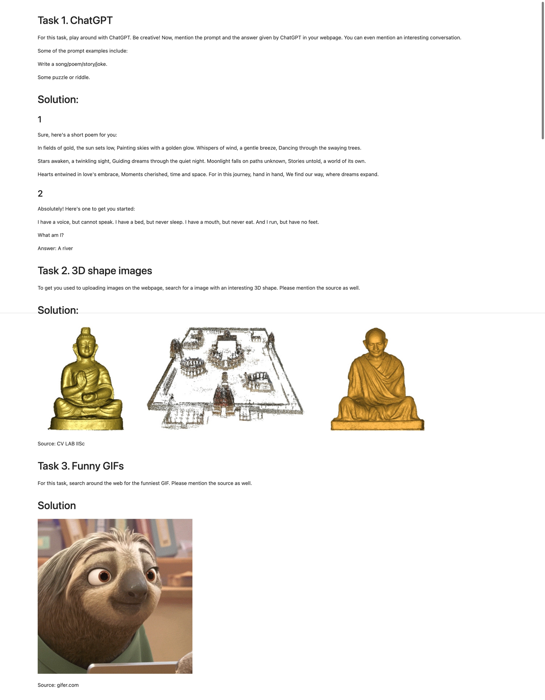

# Creating web page including.
1. Text
2. Image
3. GIF

Created in jupyter notebook markdown and converted using following command:

```linux
jupyter nbconvert --to html assignment_0.ipynb
```

# Web Page
